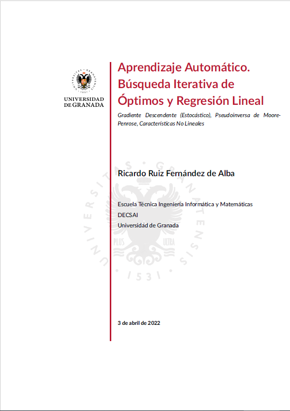
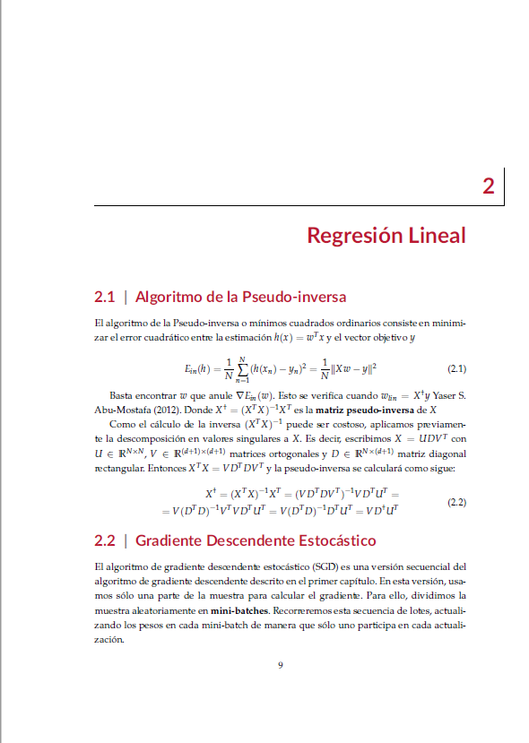

# Plantilla Latex UGR

Plantilla basada en [University of Malta dissertation template](https://github.com/jp-um/university_of_malta_LaTeX_dissertation_template) adaptada al ámbito
de la Universidad de Granada.

# Visualización

Portada | Capítulo
:-------------------------:|:-------------------------:
  |  

Véase mi repositorio de [aprendizaje automático](https://github.com/eigenric/aprendizaje-automatico) para ejemplo de uso.

# Compilación

Se incluye un fichero `Makefile` con órdenes `latex` y `clean`.
Si el índice no se renderiza adecuadamente, se recomienda la
herramienta `rubber`.
Las imágenes deben incluirse en el directorio `chap1/images`.
Para la portada, modificar las directivas `\title`, `\author`,
`\degree` del archivo [um.cls](um.cls)

# License

[GPL v3](LICENSE)